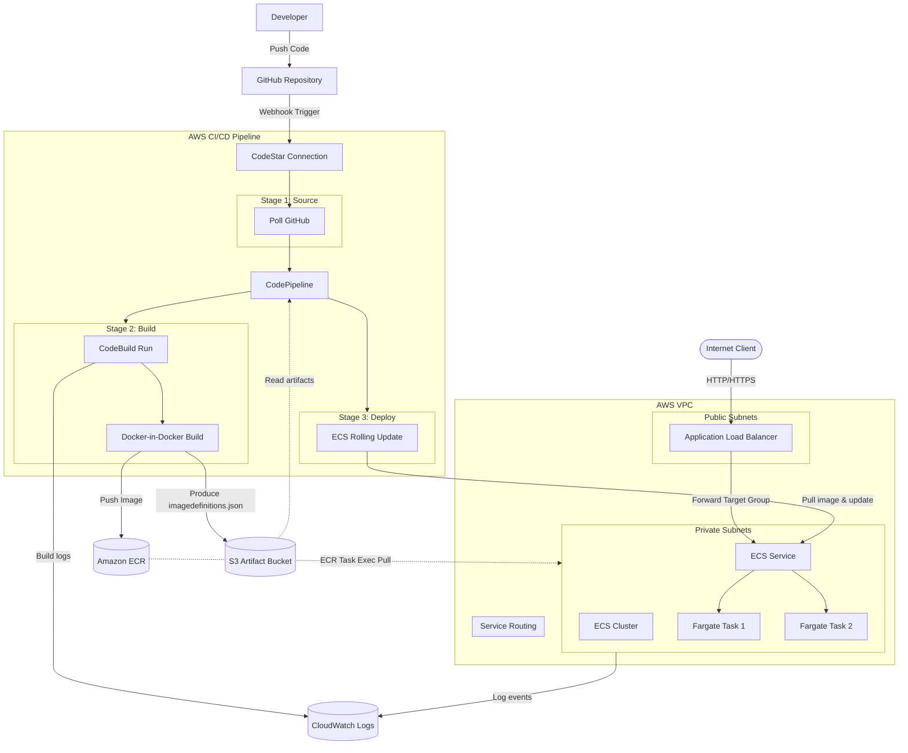

# AWS DevSecOps Infrastructure - Terraform Modules

[](https://www.terraform.io/)
[](https://registry.terraform.io/providers/hashicorp/aws/latest)
[](#security-best-practices-implemented)

This repository contains reusable, modular, and highly secure AWS infrastructure written in Terraform. It provisions a complete container deployment and delivery system on AWS using ECS (Fargate) fronted by an Application Load Balancer (ALB), with a fully automated, serverless CI/CD pipeline.

---

## 🏛️ Architecture Overview

The system composition links a multi-stage AWS CodePipeline to a private Amazon ECS Fargate cluster. Below is the architecture showing networking boundaries, resource relations, and pipeline stages:



---

## 📁 Project Structure

The codebase is organized following Terraform best practices, dividing major logical components into self-contained, decoupled modules:

```directory
.
├── README.md                   # Project Overview & Deployment Guide
├── main.tf                     # Core Module Composition
├── variables.tf                # Root Configuration Inputs
├── outputs.tf                  # Root Outputs (ALB, Pipeline, ECS)
├── providers.tf                # Providers, Tags & Version Pins
├── terraform.tfvars.example    # Template variable values file
├── buildspec.yml               # ECR Build & ECS Delivery specification
└── modules/
    ├── vpc/                    # 1. AWS VPC Networking Module
    │   ├── README.md           # VPC subnets, route tables, NAT details
    │   ├── main.tf             # VPC, subnets, IGW, NAT GW, routes
    │   ├── outputs.tf          # Subnet IDs & VPC output identifiers
    │   └── variables.tf        # CIDR blocks and environment settings
    ├── alb/                    # 2. Application Load Balancer Module
    │   ├── README.md           # ALB docs, SSL redirect details, vars
    │   ├── main.tf             # ALB, TG, Listener, HTTPS config
    │   ├── outputs.tf          # Target Group & DNS output
    │   └── variables.tf        # Healthcheck and security inputs
    ├── ecs/                    # 3. Amazon ECS (Fargate) Module
    │   ├── README.md           # ECS scaling, execution policy, vars
    │   ├── main.tf             # Cluster, Service, Task Def, SGs, IAM roles
    │   ├── outputs.tf          # Task and execution role identifiers
    │   └── variables.tf        # Resources, CPU/Mem constraints, vars
    ├── codebuild/              # 4. AWS CodeBuild Module
    │   ├── README.md           # CodeBuild compute, environment, vars
    │   ├── main.tf             # Project config, VPC networking, IAM role
    │   ├── outputs.tf          # Role and Log group identifiers
    │   └── variables.tf        # Privileged mode & cache parameters
    └── codepipeline/           # 5. AWS CodePipeline Module
        ├── README.md           # Pipeline stage triggers, S3 details, vars
        ├── main.tf             # Pipeline, S3 artifacts bucket, IAM roles
        ├── outputs.tf          # Connection and bucket details
        └── variables.tf        # Stage settings, repo sources, tags
```

---

## 🧱 Module Directory Overview

Each module contains its own documentation describing variables and outputs. Below is a high-level summary:

*   **[VPC Module](./modules/vpc/README.md)**: Configures a 2-tier networking boundary with public subnets (spanned across multiple AZs) and private subnets, fronted by an Internet Gateway and an egress-only NAT Gateway to allow Fargate tasks to pull from ECR and send logs to CloudWatch securely.
*   **[ALB Module (Optional)](./modules/alb/README.md)**: Configures an Application Load Balancer with configurable HTTP/HTTPS listeners, redirects HTTP traffic to HTTPS, sets up target groups for ECS Fargate routing, and establishes minimal-access security groups.
*   **[ECS Module](./modules/ecs/README.md)**: Establishes a Fargate cluster, Task Definitions, and Service. Features dynamic load balancer association, capacity provider strategies (Fargate/Fargate Spot weights), deployment circuit breakers with rollback, ECS Exec enablement, and separate task / execution IAM roles.
*   **[CodeBuild Module](./modules/codebuild/README.md)**: Deploys a Docker build environment featuring Local Layer Caching, dynamic IAM policy scanning (automatically grants Secrets Manager or parameter store reads based on defined env variables), and optional VPC integration for database migrations.
*   **[CodePipeline Module](./modules/codepipeline/README.md)**: Wires the delivery pipeline with Source (GitHub via CodeStar connection), Build (CodeBuild), and Deploy (ECS Service deployment) stages. Includes a fully hardened S3 bucket with public access blocks, versioning, SSE-S3 encryption, and lifecycle management.

---

## ⚙️ Prerequisites

Before executing this Terraform configuration, ensure you have:

1.  **Terraform CLI** (v1.5.0 or newer) installed.
2.  **AWS CLI v2** installed and configured with credentials for your target account.
3.  A **GitHub repository** containing your application source code and a [buildspec.yml](buildspec.yml).
4.  *(Optional)* An **Amazon ECR Repository** (only required if deploying custom build pipelines; the configuration defaults to pulling a public open-source image).
5.  *(Optional)* A pre-existing **AWS VPC** with public and private subnets (if you prefer to deploy into existing network infrastructure instead of letting Terraform create one).
6.  *(Optional)* An ACM certificate for HTTPS.

---

## 🚀 Quick Start / Deployment Instructions

### 1. Clone the Code
```bash
git clone https://github.com/TrigrD3/indico-devsecops-test.git
cd indico-devsecops-test
```

### 2. Configure Local Variables
Copy the template variable file to create your active parameters:
```bash
cp terraform.tfvars.example terraform.tfvars
```
Open `terraform.tfvars` in your editor and customize values matching your environment:
*   *(Optional)* Set `vpc_id` to deploy into a pre-existing VPC. If commented out, a new VPC will be provisioned automatically.
*   The `container_image` variable defaults to `"nginxdemos/hello:latest"` which starts up instantly without any setup or registry credentials. Update this when you want to target your own ECR container registry.
*   Set `source_repository` to your GitHub repo path (e.g. `your-organization/your-repo-name`).

### 3. Initialize Terraform
Install the AWS provider, modules, and initialize state backend:
```bash
terraform init
```

### 4. Code Quality & Format Checks
Run syntax checks and auto-format files to verify HCL integrity:
```bash
terraform fmt -recursive
terraform validate
```

### 5. Generate and Review Dry-Run Execution Plan
Generate and inspect the dry-run execution plan:
```bash
terraform plan -out=tfplan.binary
terraform show -no-color tfplan.binary > tfplan.txt
```

### 6. Deploy Infrastructure
Apply the configuration:
```bash
terraform apply tfplan.binary
```

### 7. Post-Deployment CodeStar Connection Handshake
CodePipeline will pause at the **Source** stage until you authorize the CodeStar connection.
1.  Log in to the **AWS Console** and navigate to **Developer Tools** -> **Connections**.
2.  Find the newly created connection (named `${project_name}-${environment}-github`).
3.  Click **Update pending connection** and follow the prompt to authorize AWS to access your GitHub account/repositories.
4.  Once the status changes to `Available`, the pipeline will automatically trigger.

---

## 🛡️ Security Best Practices Implemented

| Security Dimension | Implementation Detail | Benefit |
| :--- | :--- | :--- |
| **IAM Hardening** | Custom role trust policies; explicit resource constraints (`ecr:GetAuthorizationToken`, `s3:PutObject` restricted to specific target resources). | Enforces least-privilege, mitigating lateral movement risks. |
| **S3 Protection** | S3 bucket versioning, public access blocks (all 4 fields), and server-side encryption (AES256 SSE) configured for the artifacts bucket. | Prevents exposure of compiled code or configuration secrets. |
| **ALB Protection** | `drop_invalid_header_fields = true` enabled; HTTPS listener default configured to TLS 1.3 only (`ELBSecurityPolicy-TLS13-1-2-2021-06`). | Mitigates request-smuggling and ensures secure transport layer protocols. |
| **Data Protection** | Service HTTP listener automatically redirects all traffic to HTTPS (301 redirect) if `enable_https` is set to `true`. | Prevents inadvertent transmission of credentials in cleartext. |
| **ECS Hardening** | Fargate task isolation, public IP assignment disabled (`assign_public_ip = false`), ingress restricted solely to the ALB's security group. | Prevents container exposure to public internet sweeps. |
| **Observability** | ECS Container Insights enabled; CloudWatch Log Groups configured with configurable log retention and encryption. | Facilitates post-incident forensics and live performance auditing. |
| **Secrets Safety** | No hardcoded tokens. AWS CodeStar Connection dynamically handles Git webhooks; IAM variables resolve permissions. | Eliminates key leakage vectors. |

---

## 📖 Root Variable References

### Input Variables

| Variable Name | Type | Default | Description |
| :--- | :--- | :--- | :--- |
| `aws_region` | `string` | `"ap-southeast-1"` | AWS Region to deploy all infrastructure into. |
| `project_name` | `string` | `"container-app"` | Base identifier prefix for naming resources. |
| `environment` | `string` | `"dev"` | Environment name (validated: `dev`, `staging`, `production`). |
| `vpc_id` | `string` | `null` | Target AWS VPC ID. If null, a fresh VPC is created automatically. |
| `public_subnet_ids` | `list(string)` | `[]` | Public Subnet IDs for ALB. If empty, created subnets are used. |
| `private_subnet_ids` | `list(string)` | `[]` | Private Subnet IDs for ECS. If empty, created subnets are used. |
| `vpc_cidr` | `string` | `"10.0.0.0/16"` | CIDR block for the created VPC. |
| `public_subnet_cidrs`| `list(string)` | `["10.0.1.0/24", "10.0.2.0/24"]` | CIDR blocks for public subnets (min 2). |
| `private_subnet_cidrs`| `list(string)`| `["10.0.10.0/24", "10.0.11.0/24"]`| CIDR blocks for private subnets (min 2). |
| `container_image` | `string` | `"nginxdemos/hello:latest"`| Docker image URI for the application container. |
| `container_port` | `number` | `80` | Port container app binds to. |
| `cpu` | `number` | `256` | Fargate CPU units (256, 512, 1024, 2048, 4096). |
| `memory` | `number` | `512` | Fargate Memory MiB (compatible with CPU value). |
| `desired_count` | `number` | `2` | Number of active task replicas. |
| `source_repository` | `string` | *Required* | Git source repository in `'owner/repo'` format. |
| `source_branch` | `string` | `"main"` | Code branch triggers pipeline execution. |
| `enable_https` | `bool` | `false` | Toggles HTTPS listener config on ALB. |
| `certificate_arn` | `string` | `""` | ARN of SSL/TLS certificate in AWS Certificate Manager. |
| `tags` | `map(string)` | `{}` | Key-value pairs appended to default tags. |

### Outputs

| Output Name | Description |
| :--- | :--- |
| `application_url` | HTTP/HTTPS address to access your deployed container service. |
| `alb_dns_name` | Canonical hostname pointing to the Load Balancer. |
| `alb_arn` | Resource identifier for AWS WAF associations. |
| `target_group_arn` | ARN of the ALB target group. |
| `ecs_cluster_name` | ECS Fargate Cluster designation. |
| `ecs_service_name` | Active ECS service definition name. |
| `codebuild_project_name`| Configured build project name. |
| `codepipeline_arn` | ARN of the deployment pipeline. |
| `codestar_connection_arn`| Connection ARN generated to hook GitHub events. |

---

## 📚 Official Documentation References

*   **AWS Developer Guides**:
    *   [AWS Developer Console Connections Overview](https://docs.aws.amazon.com/dtconsole/latest/userguide/welcome-connections.html)
    *   [GitHub Action Connections in CodePipeline Guide](https://docs.aws.amazon.com/codepipeline/latest/userguide/update-github-action-connections.html)
    *   [Amazon ECS Fargate Developer Guide](https://docs.aws.amazon.com/AmazonECS/latest/developerguide/AWS_Fargate.html)
*   **Terraform AWS Provider Resource References**:
    *   **VPC Module**: [`aws_vpc`](https://registry.terraform.io/providers/hashicorp/aws/latest/docs/resources/vpc) \| [`aws_subnet`](https://registry.terraform.io/providers/hashicorp/aws/latest/docs/resources/subnet) \| [`aws_nat_gateway`](https://registry.terraform.io/providers/hashicorp/aws/latest/docs/resources/nat_gateway)
    *   **ALB Module**: [`aws_lb`](https://registry.terraform.io/providers/hashicorp/aws/latest/docs/resources/lb) \| [`aws_lb_target_group`](https://registry.terraform.io/providers/hashicorp/aws/latest/docs/resources/lb_target_group) \| [`aws_lb_listener`](https://registry.terraform.io/providers/hashicorp/aws/latest/docs/resources/lb_listener)
    *   **ECS Module**: [`aws_ecs_cluster`](https://registry.terraform.io/providers/hashicorp/aws/latest/docs/resources/ecs_cluster) \| [`aws_ecs_task_definition`](https://registry.terraform.io/providers/hashicorp/aws/latest/docs/resources/ecs_task_definition) \| [`aws_ecs_service`](https://registry.terraform.io/providers/hashicorp/aws/latest/docs/resources/ecs_service)
    *   **CodeBuild Module**: [`aws_codebuild_project`](https://registry.terraform.io/providers/hashicorp/aws/latest/docs/resources/codebuild_project)
    *   **CodePipeline Module**: [`aws_codepipeline`](https://registry.terraform.io/providers/hashicorp/aws/latest/docs/resources/codepipeline) \| [`aws_codestarconnections_connection`](https://registry.terraform.io/providers/hashicorp/aws/latest/docs/resources/codestarconnections_connection)

